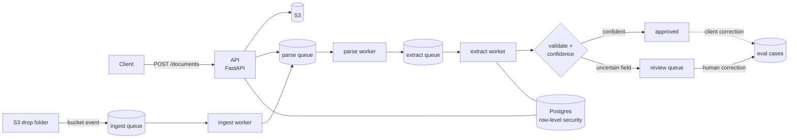

# DocFactory

A multi-tenant document-processing platform: upload an invoice or purchase order,
get back structured, validated fields, with every uncertain value routed to a human
reviewer whose corrections become evaluation data.

Deployed on AWS (ECS Fargate, SQS, S3, Terraform) with workers that scale to zero,
tenant isolation enforced by Postgres row-level security, and a CI pipeline that
blocks a deploy when extraction accuracy drops below its floors.

## What it does



1. **Ingest.** Documents arrive by API upload or by dropping a file into an S3 prefix.
   Content is hashed, so re-uploading the same file is detected as a duplicate
   rather than processed and billed twice.
2. **Parse.** Text is extracted from the PDF. Image-only scans route to
   `needs_ocr`, a deliberate terminal state rather than a failure.
3. **Extract.** A pipeline definition (`config/pipelines/*.json`) declares the schema
   for each document type. Extraction runs through a pluggable model-provider
   interface with cost metering and a per-tenant budget cap.
4. **Validate and score.** Cross-field rules (line items sum to the subtotal,
   subtotal plus tax equals the total, tax matches the rate, quantity times unit price
   equals each line amount, due date not before invoice date) feed a fitted confidence
   model that scores every field.
5. **Route.** Confident extractions are approved. Anything below threshold becomes a
   review task naming the specific fields to check, with an SLA deadline.
6. **Learn.** Reviewer and client corrections are written back as labelled
   evaluation cases, including corrections to documents that auto-approved but were
   wrong, which are the errors the confidence model cannot flag itself.

## Engineering highlights

**Multi-tenancy.** Every tenant-owned table uses `FORCE ROW LEVEL SECURITY` under a
non-superuser application role, so isolation holds even when application code forgets
a filter. The [isolation audit](docs/tenant_isolation_audit.md) was built by
inspecting the live database catalog rather than reading migrations, and all four
gaps it found are closed.

**Confidence calibration.** A 7-feature model fitted on held-out data. At the chosen
threshold it auto-approves 93.1% of fields at 99.71% precision, measured against
synthetic corruption injected at a 35% rate
([study](docs/calibration_results.md)).

**Self-healing.** A failing message gets three attempts before it is dead-lettered, and a
bounded redrive brings back work stranded by an outage. A reaper re-enqueues
documents stuck mid-pipeline, circuit breakers pause work while a provider is down,
and per-tenant rate limits and in-flight ceilings stop one tenant from starving
another. [What recovers on its own, and what needs a human](docs/runbook.md).

**Infrastructure.** Two Terraform layers: a persistent data plane (S3, SQS, secrets,
ECR, IAM, budgets) and a disposable compute plane (VPC, ECS, autoscaling). The
compute plane can be destroyed overnight and rebuilt without touching data. Workers
run on Fargate Spot and scale from zero on queue depth. No NAT gateway, and a standing
cost of about $14/month ([cost model](docs/cost_model.md)).

**CI/CD.** GitHub Actions runs lint, the test suite, and an evaluation gate against
golden document sets, then builds, migrates and rolls the services. AWS access uses
OIDC, so there are no stored credentials. The deploy detects whether the compute
plane is up, parked, or unverifiable, and fails loudly on the last.

**Observability.** Structured JSON logs, OpenTelemetry tracing, CloudWatch alarms on
backlog and dead-letter queues, [drift detection](docs/drift_experiment.md) on
extraction outputs, and per-document [unit costs](docs/unit_costs.md) from recorded
usage.

## Tech stack

Python 3.12 · FastAPI · SQLAlchemy + Alembic · PostgreSQL · SQS · S3 · Docker ·
AWS ECS Fargate · Terraform · GitHub Actions · OpenTelemetry · pytest · uv

## Repository layout

```
apps/api/            FastAPI service: upload, status, listing, review, corrections, usage
apps/worker/         queue consumers: ingest, parse, extract; healing loop
packages/core/       domain logic: pipelines, confidence, routing, review, budget,
                     backpressure, healing, tenant-scoped DB, storage and queue clients
packages/evals/      golden sets, eval harness, CI gate
config/              pipeline schemas, confidence models, eval thresholds, pricing
alembic/             database migrations (including row-level security policies)
infra/terraform/     data-plane/ and compute-plane/ AWS stacks
infra/compose/       local stack: Postgres, MinIO, ElasticMQ, Phoenix
infra/localstack/    apply-verify-destroy cycle against LocalStack
data/synth/          synthetic invoice and purchase-order generator with ground truth
docs/                architecture decision, runbooks, studies, audits
```

## Run it locally

Prerequisites: [uv](https://docs.astral.sh/uv/), Docker with Compose v2, and on
macOS `brew install pango` (for the PDF generator).

```bash
make setup      # create .env from .env.example, install the workspace
make up         # start Postgres, MinIO, ElasticMQ, Phoenix; create bucket and queues
make migrate    # apply database migrations
make seed       # generate 620 synthetic documents with ground truth
make api        # terminal 1: API on http://localhost:8000
make worker     # terminal 2: ingest, parse and extract consumers
```

Then, in a third terminal:

```bash
export KEY=$(make -s dev-key)
curl -s -H "x-api-key: $KEY" -F "file=@data/synth/out/inv-00001.pdf" \
  "http://localhost:8000/documents?doc_type=invoice"
curl -s -H "x-api-key: $KEY" "http://localhost:8000/documents/<document_id>"
```

Interactive API docs are at http://localhost:8000/docs, and traces are in Phoenix at
http://localhost:6006.

Extraction defaults to a deterministic mock provider (`MODEL_PROVIDER=mock`), so the
full pipeline, tests and evaluation gate run offline at no cost.

## API

| Method | Path | Purpose |
|---|---|---|
| `POST` | `/documents` | Upload a PDF (deduplicated by content hash) |
| `GET` | `/documents` | List documents, filterable by status and type, paginated |
| `GET` | `/documents/{id}` | Status, extracted fields, per-field confidence, validation |
| `POST` | `/documents/{id}/corrections` | Correct fields on any extraction |
| `GET` | `/review/tasks` | Open review tasks with flagged fields and SLA deadlines |
| `GET` | `/review/queue` | Open task count, SLA breaches, oldest task age |
| `POST` | `/review/tasks/{id}/resolve` | Approve as-is, or submit corrections |
| `GET` | `/usage` | Spend against budget, status counts, queue depth |

Every public endpoint except `/healthz` requires an `x-api-key` header scoped to one tenant.

## Testing and evaluation

```bash
make test        # ~630 tests; integration tests skip if the local stack is down
make lint
make eval-gate   # golden-set evaluation, fails below the floors in config/eval_thresholds.json
make calibrate   # refit the confidence model
```

## Deploy to AWS

The [deploy runbook](docs/deploy_runbook.md) covers the full procedure. In short:
apply `infra/terraform/data-plane`, then `infra/terraform/compute-plane`, and pushes
to `main` deploy through CI. Destroying `compute-plane` parks the stack while keeping
all data. `scripts/aws_orphan_check.sh --park` confirms nothing is left billing.

## Documentation

- [ADR-001: pipeline architecture](docs/adr-001-pipeline-architecture.md)
- [Operations runbook](docs/runbook.md) · [Deploy runbook](docs/deploy_runbook.md)
- [Tenant isolation audit](docs/tenant_isolation_audit.md)
- [Confidence calibration study](docs/calibration_results.md)
- [Evaluation results](docs/eval_results.md) · [Drift experiment](docs/drift_experiment.md)
- [Cost model](docs/cost_model.md) · [Unit costs](docs/unit_costs.md) · [Performance](docs/performance.md)
- [Container CVE review](docs/container_cves.md)
- [Backlog: known limitations, deliberately deferred](docs/backlog.md)

## Status and known limitations

The pipeline, infrastructure and review loop are complete and deployed. What is not:

- **Extraction accuracy is measured on the mock provider.** The evaluation results and
  calibration study use a deterministic mock extractor with injected corruption, which
  tests the pipeline, validation and routing rather than a production model.
- **No reviewer UI.** The review workflow is API-only.
- **No OCR tier yet.** Image-only scans stop at `needs_ocr`.
- **One file is one document.** No unpacking of zip archives or multi-document batches,
  and the synthetic corpus does not yet cover multi-page invoices, discounts or credit notes.

The full list, with the reasoning behind each deferral, is in
[docs/backlog.md](docs/backlog.md).
