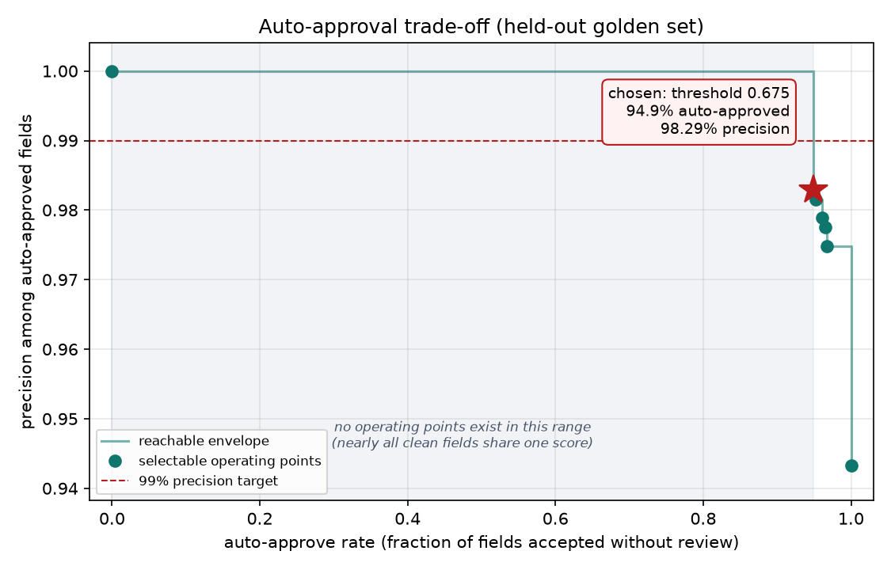
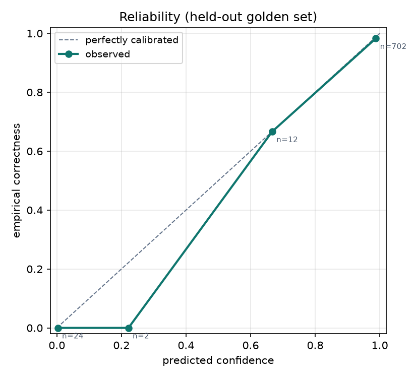

# Confidence calibration study

Fitted 2026-08-18 · git `ca1342b` · dataset built 2026-08-18T00:55:25+00:00 from 345 documents · provider `mock` · corruption rate 0.35 (seed 1337)

Unit of analysis is the **field**: the decision being calibrated is whether one
cell can be accepted without a human looking at it. Weights are fitted on the
non-golden documents; every number below is measured on the held-out golden set,
so the threshold is not reported on its own training data.

- train rows (fields): **2710** across 271 documents
- holdout rows (fields): **740** across 74 documents
- error rate in holdout: **5.7%** of fields wrong

## Operating point

Target: auto-approved fields must be **>= 99%** correct.

**Not reachable at any usable coverage.** The best achievable precision is 98.29%, so the point below is the best available — not one that meets the 99% target. Why, and what it would take, is in *Where the ceiling comes from*.

| | value |
|---|---|
| threshold | **0.6750** |
| auto-approve rate | **94.9%** of fields |
| precision among auto-approved | **98.29%** |
| fields still sent to review | 5.1% |
| target met | **NO** |

### What each precision target buys

| target | reachable | threshold | auto-approve rate | actual precision |
|---|---|---|---|---|
| 99.5% | **no** | 0.675 | 94.9% | 98.29% |
| 99.0% | **no** | 0.675 | 94.9% | 98.29% |
| 98.5% | **no** | 0.675 | 94.9% | 98.29% |
| 98.0% | yes | 0.670 | 95.3% | 98.16% |
| 97.0% | yes | 0.005 | 96.8% | 97.49% |
| 95.0% | yes | 0.005 | 96.8% | 97.49% |

**The score is discrete, not continuous.** Nearly every clean field gets an identical score, because their signal features are all zero, so coverage jumps from 0% straight to ~95% with nothing selectable in between. Only a handful of operating points exist. Phase 2.3 therefore cannot dial coverage finely: it picks one of these points. Finer control needs a feature that varies across *clean* documents (per-field extraction margin, say), not more weight tuning.

## Fitted weights

| feature | weight |
|---|---|
| `implicating_rules_failed` | -0.592 |
| `log_residual_magnitude` | -0.003 |
| `groundedness` | +1.566 |
| `shape_suspect` | -1.669 |
| `row_arithmetic_broken` | -0.664 |
| `needed_retry` | +0.000 |
| _bias_ | +3.821 |

Positive weight = pushes towards *correct*. Standardized inputs, so magnitudes
are comparable across features.

## By layout (holdout)

| layout | fields | auto-approve rate | precision |
|---|---|---|---|
| classic | 260 | 96.9% | 98.02% |
| euro | 180 | 88.9% | 97.50% |
| modern | 300 | 96.7% | 98.97% |

## By injected error class (holdout)

Documents are grouped by the error deliberately injected into them. `none` means the document was left clean.

| error class | fields | auto-approve rate | precision |
|---|---|---|---|
| `arithmetic_drift` | 40 | 67.5% | 100.00% |
| `none` | 470 | 98.1% | 99.78% |
| `shifted_date` | 100 | 97.0% | 89.69% |
| `transposed_line_amounts` | 60 | 88.3% | 100.00% |
| `truncated_vendor` | 40 | 92.5% | 97.30% |
| `wrong_vendor` | 30 | 90.0% | 100.00% |

## Where the ceiling comes from

Of 42 wrong fields in the holdout, 12 would still be auto-approved at threshold 0.675. These are the residual error — the reason a higher precision target is or is not reachable.

| injected class | field | count |
|---|---|---|
| `shifted_date` | invoice_date | 10 |
| `truncated_vendor` | vendor | 1 |
| `none` | vendor | 1 |

`shifted_date` is undetectable by construction: it moves the invoice date earlier while leaving every validation rule satisfied, so no current signal can see it. It is injected deliberately so the ceiling appears in the results rather than being hidden by only testing catchable errors.

## Reliability

Does the score behave like a probability, or only like a ranking?

| predicted | empirical | n |
|---|---|---|
| 0.003 | 0.000 | 24 |
| 0.222 | 0.000 | 2 |
| 0.667 | 0.667 | 12 |
| 0.988 | 0.983 | 702 |
