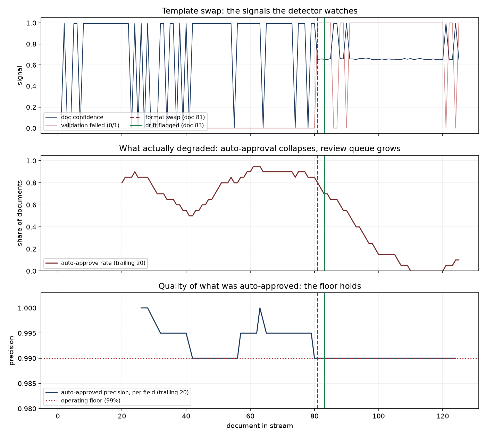

# Drift experiment — a staged vendor format change

Generated by `uv run python -m docfactory_evals.drift_experiment`. Every
number below comes from that run; nothing here is typed by hand.

## The setup

A tenant receives **80 invoices** in the layouts they have always
sent (classic / modern / euro), then **45 invoices** from the same
vendor in a redesigned template. The redesign changes three labels and nothing
else:

| before | after |
|---|---|
| Subtotal | Net Amount |
| Sales Tax | VAT |
| Total Due | Balance Owing |

Same arithmetic, same table headers, same date order, same invoice-number
scheme, same page — a human would not call it a different document. The
extractor reads amounts by label, which is how a real extraction prompt reads
them too, so a renamed total is a total it cannot find.

Everything downstream is the production path: the routed extraction the worker
runs, the deterministic validation rules, the calibrated confidence model, the
same routing threshold, the same detector. Mock mode, so the whole experiment
is free and reproducible; seeds are pinned in the module.

## The headline

The detector flagged the change **3 documents** after the swap. Auto-approved precision **never breached** the 99% floor across the 45 drifted documents — and that is the more interesting result. See *What actually degraded*.

Signals that raised the flag: `validation_failure`.

## What actually degraded

Not the accuracy of what was approved. **The confidence gate absorbed the
drift**: the redesigned invoices scored badly, fell under the routing
threshold, and went to human review instead of being approved. The Phase 2
validation rules and the Phase 2.3 operating point did exactly what they were
built to do, without knowing anything about drift.

What degraded instead was the economics, silently:

- **auto-approve rate fell 77.5% -> 11.1%** — a 66.4% drop
- **the review queue grew 4.0x** (22.5% -> 88.9% of documents)
- **every document escalated** to the expensive model (57.5% -> 100.0%), raising cost per document by 20.1%
- field accuracy fell 97.25% -> 82.22%, but almost all of that error was caught
  and routed to a human rather than shipped

This is the honest shape of the result, and it is the argument for having a
drift detector at all. Without one, a vendor format change presents as a
review queue that quadrupled overnight and a bill that went up 20%, with no
cause attached — the kind of thing a team notices in a week and diagnoses in
a day. The detector names it, with the signals that moved and the document
that tripped it, 3 documents in.

It is worth being precise about the limit: had the redesign broken extraction
in a way the confidence model was *not* calibrated to notice — a plausible
wrong value rather than a missing one — the gate would not have caught it and
the detector's lead time would have been the only warning. That case is not
staged here, and this experiment does not claim it.

## What the swap did

Auto-approved precision is per FIELD, which is the metric the operating
point was chosen against (2.2c picked threshold 0.675 for 99.71% per-field
precision). The per-document row is every field correct — a much stricter
bar that sits nowhere near 99% even on stable data, shown so the two are not
confused.

| | before the swap | after the swap |
|---|---|---|
| documents | 80 | 45 |
| field accuracy | 97.25% | 82.22% |
| mean confidence | 0.7712 | 0.6929 |
| validation failure rate | 0.0% | 88.9% |
| auto approve rate | 77.5% | 11.1% |
| auto approved precision | 99.35% | 100.00% |
| auto approved doc precision | 93.55% | 100.00% |
| escalation rate | 57.5% | 100.0% |
| cost per doc | $0.007876 | $0.009456 |

## Which signal actually fired

Three signals are watched. On this drift, one of them carried the detection
and the other two never breached — reported because a detector whose extra
signals do nothing is a detector with one signal and two decorations.

| signal | direction | mean z before | mean z after | breaches after |
|---|---|---|---|---|
| `doc_confidence` | down | +0.32 | -0.05 | 0/45 |
| `validation_failure` | up | +0.00 | +9.02 | 40/45 |
| `text_distance` | up | -0.24 | +0.37 | 0/45 |

**`validation_failure` did the work.** The redesign makes the arithmetic
checks fail on almost every document, which is a step change from a baseline
rate of zero — z ~ +10, every document, caught in k.

**`doc_confidence` barely moved**, and the reason is instructive: the baseline
here is a *mixed* stream of three layouts with genuinely different difficulty,
so its confidence distribution is wide. A drifted document at ~0.65 sits
inside that spread. The signal would be far sharper against a per-vendor or
per-layout baseline, which is what `window_key` on `drift_stats` is for and
what a v2 should do.

**`text_distance` did not breach either**, for the same reason plus one of its
own: three labels changed out of a page of vendor names, addresses, line-item
descriptions, dates and amounts, so most of the vocabulary is identical. A
hashed lexical profile can only see what the words do. Against a
single-layout baseline the same comparison reaches z ~ +3 (measured while
sizing `profile_dim`); against a three-layout baseline it does not.

The honest read: on this drift the deterministic validation rules were the
early-warning system, and the other two signals are insurance against the
drifts that do not break arithmetic — a vendor who changes wording without
breaking totals moves `text_distance` and nothing else. That case is not
staged here.

## The control arm

An identical-length run with **no swap** — 80 + 45 documents of the ordinary layout mix, different seed.

- drift flagged: **no**
- auto-approve rate: 77.5% -> 91.1%
- field accuracy: 97.25% -> 98.00%

The detection number above means nothing without this one. A detector that
fires on data that did not change is noise, and noise gets switched off.

## The detector

- baseline: the first **50** documents per tenant x type,
  then frozen. Below that it reports `baseline` and makes no claims.
- breach: |z| >= **3.0** against the frozen baseline,
  one-tailed in the direction that is bad.
- drift: **3 consecutive** breaching documents on one
  signal. This is what separates a weird document from a changed format.
- signals: `doc_confidence`, `validation_failure`, `text_distance` — all
  by-products of work already done. No model call is made to detect drift.

